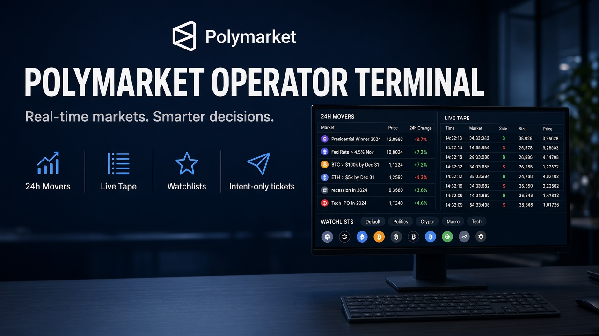
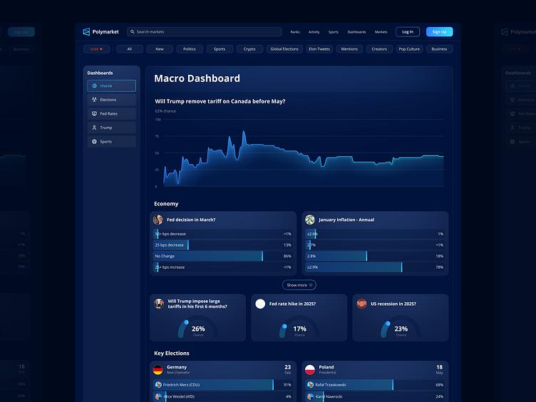
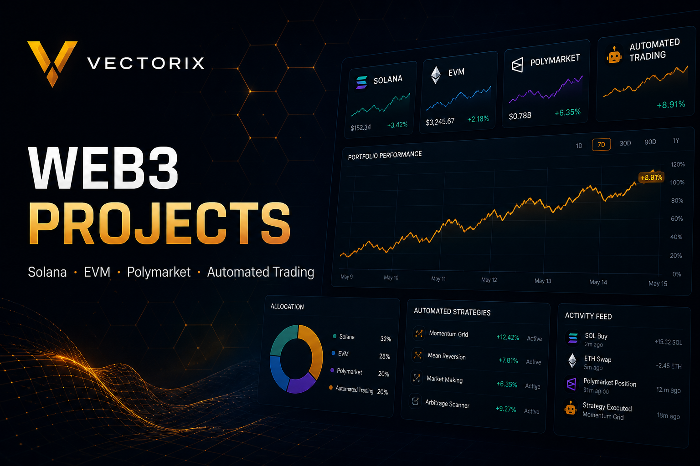
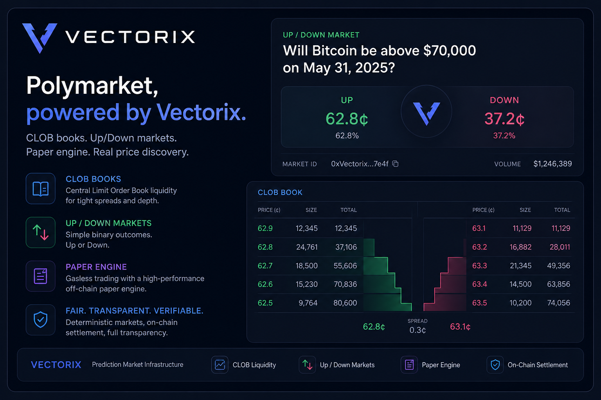

<!-- ========================================================= -->
<!--                 VECTORIX — PORTFOLIO                        -->
<!-- ========================================================= -->

# My Portfolio

Prediction-market automation, crypto trading systems, and token-launch infrastructure. Vectorix (`vectorix-cross`) — Vanja Sretenovic.

Work covers **Polymarket trading bots**, **live betting / market desks**, **Pump.fun-style token launch**, **Solana DEX arbitrage**, and **cross-chain vaults**. Public clones are paper-first or architecture; production wallets, launchpads, and custom strategies go through contact.

  

<em>Click any project cover to open its slideshow in the interactive gallery.</em>

## Featured Projects

<table>
<tr>
<td width="50%" valign="top">
<h3 align="center">01. Polymarket trading bot</h3>

  

Flagship Polymarket trading bot. Gamma discovery, live CLOB books, strategy boards (cascade, flow, late-window), snipers and market-making, whale tracker, paper fills, and hard risk caps.

<strong>Portfolio category:</strong> Prediction markets / Automated trading

<code>TypeScript</code> <code>Python</code> <code>Polymarket CLOB</code> <code>Trading bot</code> <code>Risk engine</code>

<a href="https://github.com/vectorix-cross/My-Polymarket-trading-bot-python">🔗 <strong>VIEW PROJECT</strong></a>

</td>
<td width="50%" valign="top">
<h3 align="center">02. Polymarket desk</h3>

  

Operator terminal for Polymarket: 24h movers, live tape, consensus screens, watchlists, and intent-only tickets. No custody, no wallet keys.

<strong>Portfolio category:</strong> Market intelligence / Trading desk

<code>Python</code> <code>Polymarket</code> <code>Live tape</code> <code>Watchlists</code>

<a href="https://github.com/vectorix-cross/polymarket-desk">🔗 <strong>VIEW PROJECT</strong></a>

</td>
</tr>
<tr>
<td width="50%" valign="top">
<h3 align="center">03. Polymarket dashboard</h3>

  

Gamma analytics: volume, liquidity, categories, watchlist, and price alerts. React / TypeScript desk for scanning prediction markets.

<strong>Portfolio category:</strong> Analytics dashboard / Full-stack

<code>React</code> <code>TypeScript</code> <code>Express</code> <code>Polymarket Gamma</code>

<a href="https://github.com/vectorix-cross/PolyMarketDashboard">🔗 <strong>VIEW PROJECT</strong></a>

</td>
<td width="50%" valign="top">
<h3 align="center">04. AlexBET Lite</h3>

  

Sports betting signal tracker: line movement, +EV scans, bankroll notes, multi-sport boards. Same desk mindset as the Polymarket work.

<strong>Portfolio category:</strong> Betting / Market signals

<code>JavaScript</code> <code>Odds API</code> <code>Betting</code> <code>Line movement</code>

<a href="https://github.com/vectorix-cross/alexbet-lite">🔗 <strong>VIEW PROJECT</strong></a>

</td>
</tr>
<tr>
<td width="50%" valign="top">
<h3 align="center">05. Pump.fun launchpad</h3>

  

One repo: Anchor bonding-curve program, Next.js launch UI, and indexer API. Virtual LP, swap, fees, vesting, Raydium AMM/CPMM migrate.

<strong>Portfolio category:</strong> Token launch / Full-stack Web3

<code>Rust</code> <code>Anchor</code> <code>Next.js</code> <code>Pump.fun</code> <code>Raydium</code>

<a href="https://github.com/vectorix-cross/My-Pumpfun">🔗 <strong>VIEW PROJECT</strong></a>

</td>
<td width="50%" valign="top">
<h3 align="center">06. Solana arbitrage bot</h3>

  

Rust off-chain scanner plus on-chain swap program. Sizes the route across Serum, Orca, Saber, Aldrin, Mercurial.

<strong>Portfolio category:</strong> Crypto trading bot / DeFi

<code>Rust</code> <code>Solana</code> <code>Arbitrage</code> <code>AMM</code>

<a href="https://github.com/vectorix-cross/Solana-arbitrage-bot">🔗 <strong>VIEW PROJECT</strong></a>

</td>
</tr>
<tr>
<td width="50%" valign="top">
<h3 align="center">07. CrossYield</h3>

  

Cross-chain RWA path: Ethereum deposit, Wormhole VAA, Solana vault shares, harvest loop.

<strong>Portfolio category:</strong> DeFi / Cross-chain

<code>Solidity</code> <code>Solana</code> <code>Wormhole</code> <code>RWA</code>

<a href="https://github.com/vectorix-cross/CrossYield">🔗 <strong>VIEW PROJECT</strong></a>

</td>
<td width="50%" valign="top">
<h3 align="center">08. Solana presale</h3>

  

Anchor presale: sale windows, allocation tickets, price config, claim path for SPL tokens.

<strong>Portfolio category:</strong> Token sale / Smart contract

<code>Rust</code> <code>Anchor</code> <code>Presale</code> <code>SPL</code>

<a href="https://github.com/vectorix-cross/Solana-Presale-Smart-contract">🔗 <strong>VIEW PROJECT</strong></a>

</td>
</tr>
<tr>
<td width="50%" valign="top">
<h3 align="center">09. Solana trading bots</h3>

  

Bundlers, snipers, copy-trade, and makers on Raydium, Pump.fun, and Meteora. Public arb bot plus the rest of the family map.

<strong>Portfolio category:</strong> Crypto trading bots / Solana

<code>Solana</code> <code>Raydium</code> <code>Pump.fun</code> <code>Meteora</code>

<a href="https://github.com/vectorix-cross/My-solana-trading-bots">🔗 <strong>VIEW PROJECT</strong></a>

</td>
<td width="50%" valign="top">
<h3 align="center">10. Solana NFT staking</h3>

  

Stake NFT, pNFT, and cNFT collections: lock, emit rewards, unstake. Built for collection launches that need a farm.

<strong>Portfolio category:</strong> NFT / Solana program

<code>Rust</code> <code>Solana</code> <code>NFT</code> <code>Staking</code>

<a href="https://github.com/vectorix-cross/solana-nft-staking">🔗 <strong>VIEW PROJECT</strong></a>

</td>
</tr>
</table>

  <strong>Want a bot on a wallet, a launchpad, or a custom desk?</strong>
  <a href="mailto:vanjasretenovic4@gmail.com">Email</a>
  ·
  <a href="https://t.me/vectoris_corss">Telegram</a>

  <a href="https://github.com/vectorix-cross">← Back to Profile</a>

