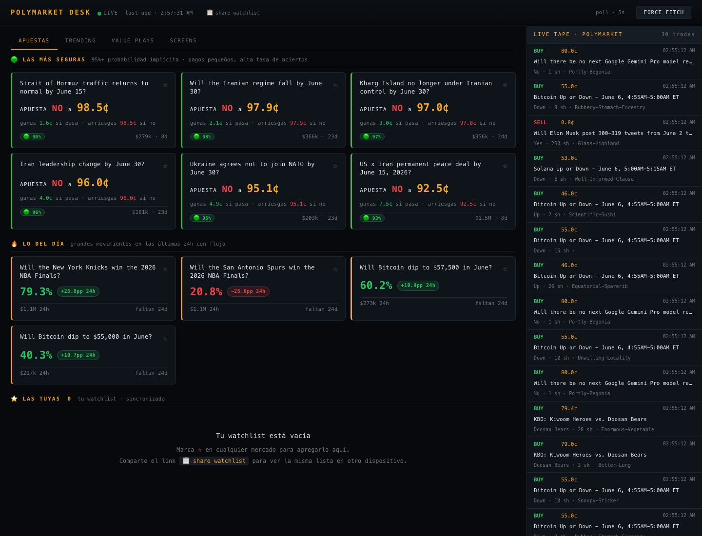
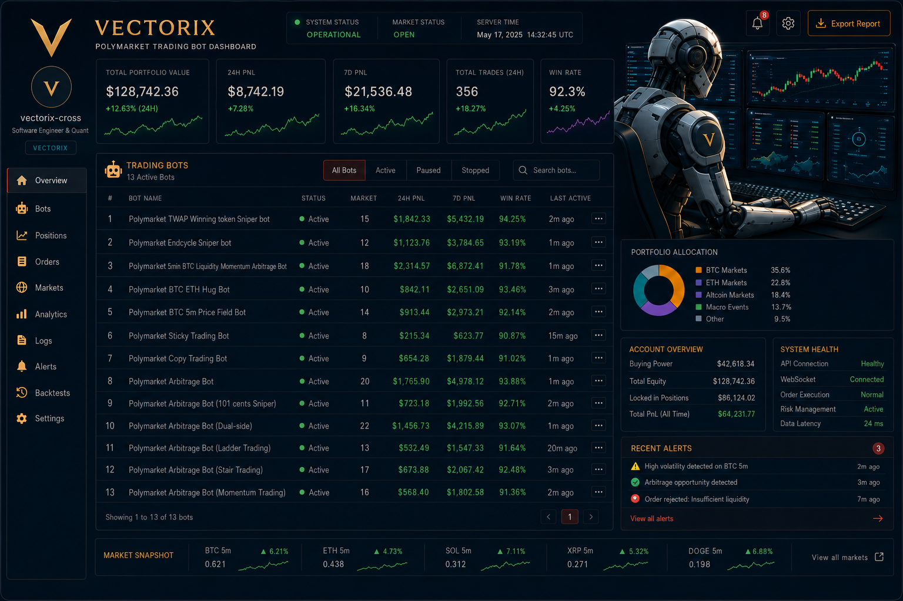
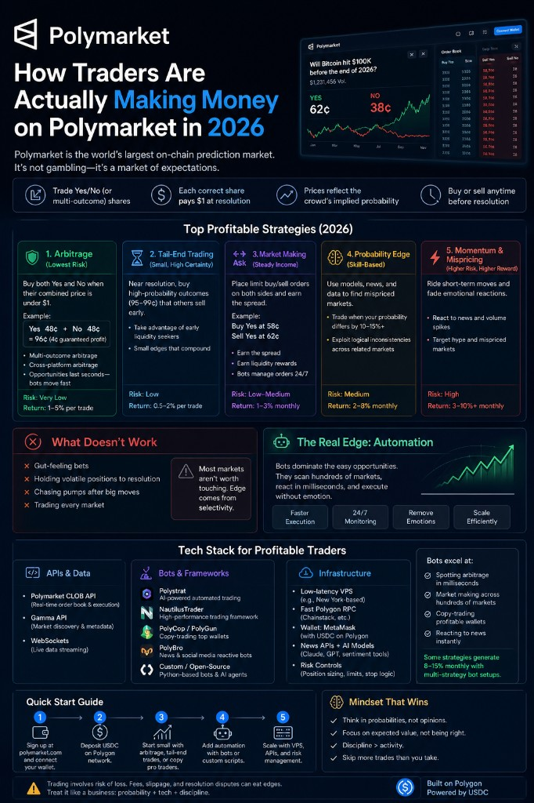
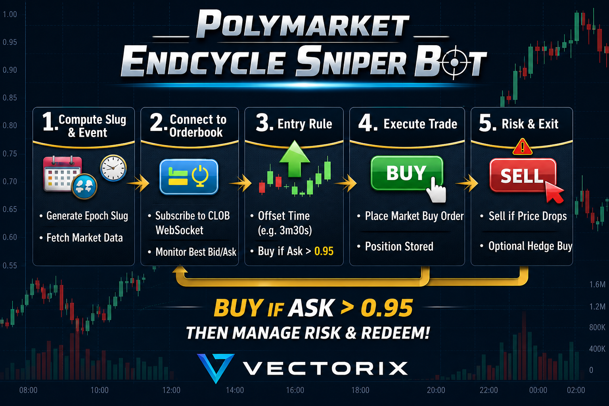

<!-- ========================================================= -->
<!--                 VECTORIX — PORTFOLIO                        -->
<!-- ========================================================= -->

# My Portfolio

Prediction-market automation, crypto trading systems, and token-launch infrastructure. Vectorix (`vectorix-cross`) — Vanja Sretenovic.

Work covers **Polymarket trading bots**, **betting / market desks**, **Solana token launch and memecoin pools**, **cross-chain DeFi**, and **on-chain marketplaces** — from CLOB microstructure through execution and risk caps.

  

<em>Click any project cover to open its slideshow in the interactive gallery.</em>

## Featured Projects

<table>
<tr>
<td width="50%" valign="top">
<h3 align="center">01. Polymarket trading bot</h3>

  

Flagship Polymarket trading bot. Gamma discovery, live CLOB books, probability vs quote, eight TypeScript strategies, whale tracker, paper fills, and hard risk caps.

<strong>Portfolio category:</strong> Prediction markets / Automated trading

<code>TypeScript</code> <code>Python</code> <code>Polymarket CLOB</code> <code>Trading bot</code> <code>Risk engine</code>

<a href="https://github.com/vectorix-cross/My-Polymarket-trading-bot-python">🔗 <strong>VIEW PROJECT</strong></a>

</td>
<td width="50%" valign="top">
<h3 align="center">02. Polymarket desk</h3>

  

Operator terminal for Polymarket: 24h movers, live tape, consensus screens, watchlists, and intent-only tickets. No custody, no wallet keys.

<strong>Portfolio category:</strong> Market intelligence / Trading desk

<code>Python</code> <code>Polymarket</code> <code>Live tape</code> <code>Watchlists</code>

<a href="https://github.com/vectorix-cross/polymarket-desk">🔗 <strong>VIEW PROJECT</strong></a>

</td>
</tr>
<tr>
<td width="50%" valign="top">
<h3 align="center">03. Polymarket dashboard</h3>

  

Gamma analytics: volume, liquidity, categories, watchlist, and price alerts. React / TypeScript desk for scanning prediction markets.

<strong>Portfolio category:</strong> Analytics dashboard / Full-stack

<code>React</code> <code>TypeScript</code> <code>Express</code> <code>Polymarket Gamma</code>

<a href="https://github.com/vectorix-cross/PolyMarketDashboard">🔗 <strong>VIEW PROJECT</strong></a>

</td>
<td width="50%" valign="top">
<h3 align="center">04. AlexBET Lite</h3>

  

Sports betting signal tracker: line movement, +EV scans, bankroll notes, multi-sport boards. Same desk mindset as the Polymarket work.

<strong>Portfolio category:</strong> Betting / Market signals

<code>JavaScript</code> <code>Odds API</code> <code>Betting</code> <code>Line movement</code>

<a href="https://github.com/vectorix-cross/alexbet-lite">🔗 <strong>VIEW PROJECT</strong></a>

</td>
</tr>
<tr>
<td width="50%" valign="top">
<h3 align="center">05. Strategy boards</h3>

  

Research line for 5- and 15-minute crypto markets: cascade trailing, late-window, blackout confirmation, Binance taker flow, oracle lag.

<strong>Portfolio category:</strong> Quant research / Prediction markets

<code>EV</code> <code>Order flow</code> <code>Latency</code> <code>Risk</code>

<a href="https://github.com/vectorix-cross/My-Polymarket-trading-bot-python">🔗 <strong>VIEW PROJECT</strong></a>

</td>
<td width="50%" valign="top">
<h3 align="center">06. Snipers &amp; market making</h3>

  

End-cycle sniper, TWAP winning-token, 101-cent maker, ladder and stair exits on short-interval YES/NO books.

<strong>Portfolio category:</strong> Market making / Microstructure

<code>CLOB</code> <code>TWAP</code> <code>Market making</code> <code>5-minute markets</code>

<a href="https://github.com/vectorix-cross/My-Polymarket-trading-bot-python">🔗 <strong>VIEW PROJECT</strong></a>

</td>
</tr>
<tr>
<td width="50%" valign="top">
<h3 align="center">07. Web3 &amp; token launch</h3>

  

Catalog of Solana trading bots, Pump.fun launchpads, memecoin pools, and on-chain automation. Implementation trees stay private; this is the public map.

<strong>Portfolio category:</strong> Token launch / Memecoin / Pools

<code>Solana</code> <code>Pump.fun</code> <code>Raydium</code> <code>Token launch</code>

<a href="https://github.com/vectorix-cross/My-web3-projects">🔗 <strong>VIEW PROJECT</strong></a>

</td>
<td width="50%" valign="top">
<h3 align="center">08. CrossYield</h3>

  

Cross-chain RWA path: Ethereum deposit, Wormhole VAA, Solana vault shares, harvest loop.

<strong>Portfolio category:</strong> DeFi / Cross-chain

<code>Solidity</code> <code>Solana</code> <code>Wormhole</code> <code>RWA</code>

<a href="https://github.com/vectorix-cross/CrossYield">🔗 <strong>VIEW PROJECT</strong></a>

</td>
</tr>
<tr>
<td width="50%" valign="top">
<h3 align="center">09. Solana arbitrage bot</h3>

  

DEX route scan on Solana: size the path, estimate fill, execute while the pool still quotes. Private implementation; cataloged under Web3 projects.

<strong>Portfolio category:</strong> Crypto trading bot / DeFi

<code>Rust</code> <code>Solana</code> <code>Arbitrage</code> <code>AMM</code>

<a href="https://github.com/vectorix-cross/My-web3-projects">🔗 <strong>VIEW PROJECT</strong></a>

</td>
<td width="50%" valign="top">
<h3 align="center">10. Pump.fun launch stack</h3>

  

Bonding-curve launch: frontend, backend, and Anchor program — create, buy, sell, graduate a mint. Private repos; listed in the Web3 catalog.

<strong>Portfolio category:</strong> Token launch / Full-stack Web3

<code>TypeScript</code> <code>Anchor</code> <code>Pump.fun</code> <code>Bonding curve</code>

<a href="https://github.com/vectorix-cross/My-web3-projects">🔗 <strong>VIEW PROJECT</strong></a>

</td>
</tr>
<tr>
<td width="50%" valign="top">
<h3 align="center">11. NFT marketplace</h3>

  

Listings, bids, and settlement — Ethereum marketplace plus TypeScript backend / indexer. Private trees; proof of work on request.

<strong>Portfolio category:</strong> NFT / Marketplace / Backend

<code>Solidity</code> <code>TypeScript</code> <code>NFT</code> <code>Orders</code>

<a href="https://github.com/vectorix-cross/My-web3-projects">🔗 <strong>VIEW PROJECT</strong></a>

</td>
<td width="50%" valign="top">
<h3 align="center">12. Node blockchain</h3>

  

Educational TypeScript chain: RSA-signed transfers, Merkle roots, configurable PoW, CLI, and tests.

<strong>Portfolio category:</strong> Blockchain fundamentals / TypeScript

<code>TypeScript</code> <code>PoW</code> <code>Merkle</code> <code>Wallets</code>

<a href="https://github.com/vectorix-cross/node-blockchain">🔗 <strong>VIEW PROJECT</strong></a>

</td>
</tr>
</table>

  <a href="https://github.com/vectorix-cross">← Back to Profile</a>

